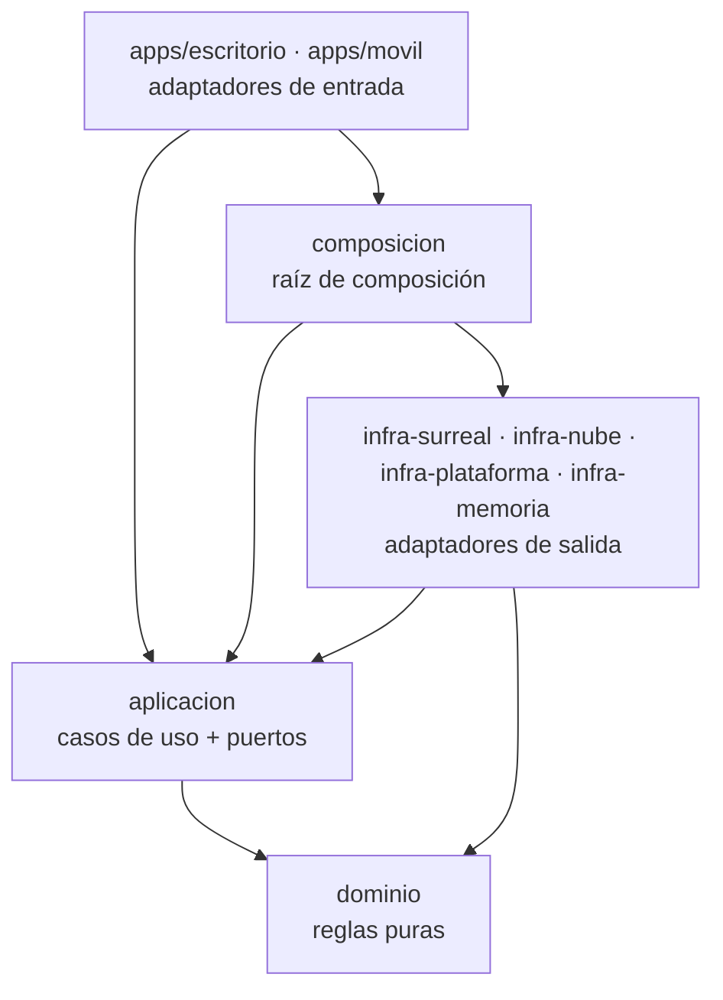
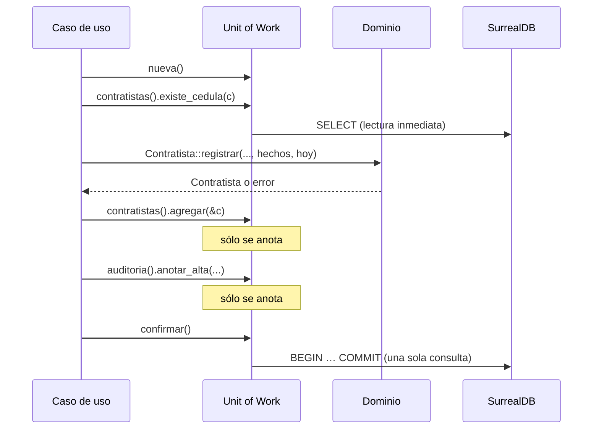
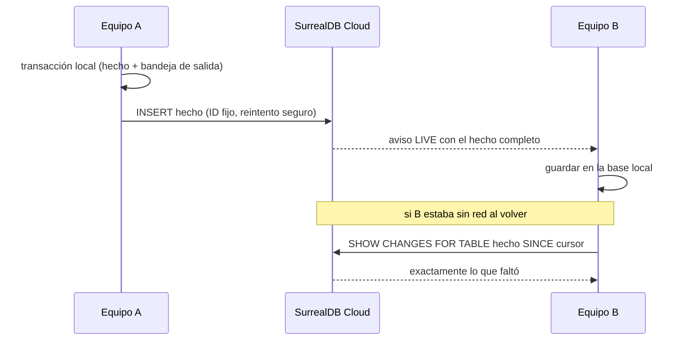

# Arquitectura de Limen

Guía de trabajo para cualquier persona o sesión que continúe el proyecto. Explica cómo
está organizado Limen, qué patrones usa, por qué, y cómo agregar cosas sin romper el
diseño. Si algo de este documento deja de ser cierto, se corrige aquí en el mismo
commit que lo cambia.

Documentos relacionados:

- [`reglas.md`](reglas.md): catálogo de reglas de negocio con su código (A1, B6…) y
  estado.
- [`../AGENTS.md`](../AGENTS.md): preferencias del usuario y reglas de trabajo.

---

## 1. Contexto

Limen es un sistema de control de acceso para instalaciones: registra la entrada y
salida de contratistas, proveedores, ingresos por correo y personal KOF (personal
interno de FEMSA) en los puntos de acceso de varios sitios.

Es el sucesor de **Lattis** (`DQM27/acceso_CLI`). Lattis funcionaba en producción, pero
creció de forma incremental y acumuló problemas estructurales que Limen resuelve desde
el diseño:

| Problema en Lattis | Cómo lo resuelve Limen |
|---|---|
| Dos bases de datos (SQLite local + Postgres en Supabase) con dos esquemas e historiales de migración paralelos | Un solo motor, SurrealDB, embebido en cada equipo y en la nube, con el mismo esquema |
| Sincronización frágil: filas mutables, marcas de agua por hora, traslapes y reconciliaciones | Hechos inmutables y changefeed con secuencia asignada por el servidor (sección 9) |
| `AppCore`: un objeto con 130 métodos y un `Mutex` global para toda la app | Un caso de uso por struct y una raíz de composición sin lógica (sección 6) |
| Reglas repartidas entre dominio, servicios y un crate `reglas` aparte para WebAssembly | Toda regla vive en `crates/dominio`, que además compila a WebAssembly |
| Pruebas que siempre necesitaban SQLite | Dobles en memoria y pruebas de contrato (sección 11) |
| Interfaces de repositorio definidas en la capa de base de datos | Puertos definidos en `aplicacion`, implementados por la infraestructura |

Restricciones que guían las decisiones:

- **Funciona sin conexión.** Un punto de acceso nunca deja de registrar por falta de
  internet.
- **Presupuesto de nube limitado:** alrededor de 25 USD al mes (sección 10).
- **Equipo pequeño:** se prefiere poco código claro a frameworks genéricos.

---

## 2. Principios

1. **Arquitectura hexagonal (puertos y adaptadores) con las capas de Clean
   Architecture.** Las dependencias apuntan siempre hacia adentro.
2. **Toda regla de negocio vive en el dominio, sin excepción.** Los casos de uso
   orquestan, no deciden.
3. **El dominio es puro:** sin base de datos, red, reloj del sistema ni aleatoriedad.
4. **Los hechos no se editan, se agregan.** Lo que ocurre en el punto de acceso es
   inmutable (sección 9.1); el estado que se muestra se actualiza en la misma
   transacción.
5. **Sin ORM.** Las consultas se escriben a la vista, en SurrealQL.
6. **Sin magia:** nada de frameworks de inyección de dependencias, buses ni mediadores.
   Las dependencias se pasan por constructor.
7. **Simple antes que genérico.** No se construye nada "por si acaso" (por ejemplo, no
   hay ejecutor de migraciones: sección 8.4).

---

## 3. Capas y regla de dependencias



| Capa (Clean) | Crate | Responsabilidad | Prohibido |
|---|---|---|---|
| Entidades | `dominio` | Entidades, objetos de valor, reglas, errores de negocio | Cualquier E/S, `async`, reloj del sistema, generar IDs |
| Casos de uso | `aplicacion` | Orquestar una operación; definir los **puertos** (traits) que necesita | Reglas de negocio; SurrealQL; tipos de SurrealDB o Tauri |
| Adaptadores de salida | `infra-*` | Implementar los puertos: SurrealDB, nube, Keystore/DPAPI, dobles | Reglas de negocio |
| Composición | `composicion` | Construir el grafo de objetos al arrancar | Lógica de cualquier tipo |
| Adaptadores de entrada | `apps/*` | Traducir comando de la interfaz → caso de uso → respuesta | Reglas; acceso directo a la base |

La regla se hace cumplir con **límites de crate**: el compilador impide que `dominio`
importe algo que no declara. Además, `crates/dominio/tests/arquitectura.rs` falla si el
dominio agrega una dependencia fuera de la lista permitida (`chrono`, `thiserror`,
`uuid`). Cada crate nuevo de las capas internas debe traer su propia prueba de
arquitectura.

### Estructura de carpetas (objetivo)

```text
Cargo.toml                  workspace + lints estrictos compartidos
crates/
  dominio/                  ✅ reglas puras
  aplicacion/               ✅ casos_de_uso/, puertos/, errores.rs
  infra-surreal/            ✅ repositorios, consultas, Unit of Work, esquema .surql
  infra-nube/               sincronización con SurrealDB Cloud, avisos en vivo
  infra-plataforma/         ✅ reloj confiable (NTP), IDs, Argon2id; luego DPAPI y Keystore
  infra-memoria/            ✅ dobles en memoria para pruebas
  composicion/              ✅ construir `Aplicacion`
  pruebas-contrato/         ✅ batería que corre contra todos los adaptadores (sólo pruebas)
apps/
  escritorio/               ✅ Tauri 2 + Angular 22 (comandos delgados en `comandos/`)
  movil/                    por decidir: Tauri 2 móvil con la misma interfaz y un plugin
                            Kotlin para la cámara (propuesta), o UniFFI + Kotlin como Lattis
docs/
  arquitectura.md           este documento
  reglas.md                 catálogo de reglas
  operacion-sin-conexion.md la portería sin red y los choques al sincronizar
  continuar.md              dónde quedó el trabajo y qué sigue
```

Sólo existe lo marcado con ✅. El resto se crea en el orden de la sección 13.

---

## 4. Dominio (`crates/dominio`)

### 4.1 Qué contiene

- **Objetos de valor** que sólo se construyen válidos: `Cedula`, `NombrePersona`,
  `NombreEmpresa`. Su constructor normaliza y valida; tener uno garantiza la regla.
- **Entidades** con campos privados y métodos que aplican las reglas: `Contratista`,
  `Empresa`.
- **Identificadores** tipados (`ContratistaId`, `EmpresaId`) que envuelven un UUID v7.
- **Errores de negocio** con mensaje (vía `Display`) y **código estable**
  (`codigo()`), para que las interfaces distingan el motivo sin comparar textos.
- **Funciones de decisión** (`verificar_acceso`).

### 4.2 Patrón "los hechos los trae el caso de uso, el dominio decide"

Algunas reglas necesitan datos de la base: "la cédula no se repite", "la empresa
existe", "no se cambia la cédula de quien está adentro". En Lattis esas reglas vivían
escondidas en los servicios. En Limen **también viven en el dominio**:

1. El caso de uso consulta los datos necesarios a través de los puertos.
2. Los entrega al dominio en un struct de hechos (`HechosContratista`,
   `HechosEmpresa`).
3. El dominio aplica la regla y decide.

```rust
// aplicacion (orquesta)
let cedula = cedula_de_contratista(datos.cedula)?;             // regla de dominio
let hechos = HechosContratista {
    cedula_en_uso: uow.contratistas().existe_cedula(&cedula).await?,
    empresa_existe: uow.empresas().existe(datos.empresa).await?,
    esta_adentro: false,
};
let contratista = Contratista::registrar(id, datos, hechos, hoy)?; // el dominio decide
```

Así, para saber qué reglas tiene un contratista basta con leer `contratista.rs`.

### 4.3 Pureza

- **Fecha de hoy:** la recibe como parámetro (`hoy: NaiveDate`), nunca llama al reloj.
- **IDs:** los recibe ya generados. El caso de uso los genera con un puerto.
- **Sin `async`, sin `serde`, sin tipos de SurrealDB.** El mapeo a la base vive en la
  infraestructura.
- Dependencias permitidas: `chrono`, `thiserror`, `uuid`. Por eso compila a
  WebAssembly: **no existe un crate de "reglas" aparte**. Si el panel web necesita las
  reglas, se agrega un crate de envoltura mínimo que sólo las expone a JavaScript.

### 4.4 Construcción y reconstrucción

- `Entidad::registrar(...)` crea una entidad nueva aplicando **todas** las reglas.
- `Entidad::restaurar(Guardado)` reconstruye una entidad leída de la base. Recibe
  objetos de valor ya tipados (la cédula ya es `Cedula`), pero **no** vuelve a aplicar
  reglas que pudieron dejar de cumplirse con el tiempo (un PRAIND que venció después de
  guardarse).
- Los campos son privados: no hay forma de construir una entidad inválida desde fuera.

### 4.5 Auditoría

Todo cambio queda auditado, por insignificante que parezca (regla B11), también el alta.
El dominio decide **qué** cambió: cada entidad describe sus campos auditables una sola
vez, y de esa lista salen el alta (`cambios_de_alta()`) y las diferencias de una edición
(`Vec<CambioCampo>` con el campo, el valor anterior y el nuevo). El caso de uso agrega
**quién** y **cuándo**, y lo guarda en la misma Unit of Work que el cambio.

Cada entrada de auditoría tiene su propio ID ordenable (UUID v7) y **el historial se ordena
por ese ID, no por la hora**: dos cambios en el mismo instante empatan en la hora, nunca en
el ID.

---

## 5. Aplicación (`crates/aplicacion`)

### 5.1 Un caso de uso = un struct

Cada operación es un tipo propio que recibe por constructor sólo los puertos que
necesita, y expone un método `ejecutar`:

```rust
pub struct RegistrarContratista<F, R, G> {
    uow: F,     // FabricaUnidadDeTrabajo
    reloj: R,   // Reloj
    ids: G,     // GeneradorIds
}

impl<F: FabricaUnidadDeTrabajo, R: Reloj, G: GeneradorIds> RegistrarContratista<F, R, G> {
    pub async fn ejecutar(
        &self,
        sesion: &Sesion,
        cmd: ComandoRegistrarContratista,
    ) -> Result<ContratistaId, ErrorRegistrarContratista> {
        let hoy = self.reloj.hoy();
        let mut uow = self.uow.nueva();

        let cedula = cedula_de_contratista(&cmd.cedula)?;
        let hechos = HechosContratista {
            cedula_en_uso: uow.contratistas().existe_cedula(&cedula).await?,
            empresa_existe: uow.empresas().existe(cmd.empresa).await?,
            esta_adentro: false,
        };
        let contratista =
            Contratista::registrar(self.ids.contratista(), cmd.como_datos(), hechos, hoy)?;

        uow.contratistas().agregar(&contratista);
        uow.auditoria().anotar_alta(sesion, &contratista);
        uow.confirmar().await?;
        Ok(contratista.id())
    }
}
```

Un caso de uso:

- **No contiene reglas.** Si aparece un `if` que decide algo de negocio, va al dominio.
- **Sí decide el orden:** primero leer, después pedirle al dominio, después escribir y
  confirmar.
- Nunca deja una llamada de red dentro de una transacción abierta.

### 5.2 Puertos (traits)

Los puertos se **definen en `aplicacion`**, porque es quien los necesita, y se
**implementan** en `infra-*`. Esa es la inversión de dependencias que convierte la
arquitectura en hexagonal.

| Puerto | Para qué |
|---|---|
| `FabricaUnidadDeTrabajo` / `UnidadDeTrabajo` | Transacción y acceso a los repositorios (sección 7) |
| `RepositorioContratistas`, `RepositorioEmpresas`, … | Leer y anotar escrituras de un agregado |
| `Consultas*` | Lecturas para pantallas (listas, búsquedas, historial) |
| `Reloj` | Fecha de hoy en Costa Rica, instante UTC y la lectura con su margen de error para sellar movimientos (E5). En producción, `RelojConfiable`: hora NTP anclada al reloj monotónico |
| `GeneradorIds` | UUID v7 para entidades nuevas |
| `CanalNube` | Enviar hechos y recibir los de otros equipos |
| `Firmante` | Firmar con la clave privada del equipo |

Decisiones de implementación:

- **`async fn` en traits** (Rust estable) con **genéricos** en los casos de uso. Se
  evita `dyn Trait` para no necesitar `async-trait` ni cajas.
- Repositorios **por agregado** y con métodos de intención
  (`existe_cedula`, `personas_adentro`). **No** hay repositorio genérico con
  `find_all()`.
- Los errores de infraestructura se traducen a un error de aplicación
  (`ErrorPersistencia`); el caso de uso nunca ve un error de SurrealDB.

### 5.3 Lecturas (CQRS ligero)

Las pantallas (listas, búsqueda, historial) no necesitan reglas: usan puertos de
**consulta** que devuelven modelos de lectura planos, sin pasar por las entidades. Las
escrituras sí pasan siempre por el dominio.

### 5.4 Sesión y autorización

Hay un solo rol: **Operador** (regla L1). No hay matriz de permisos. El caso de uso
recibe la `Sesion` para auditar quién hizo cada cambio y para exigir que exista una
sesión válida (regla E6).

---

## 6. Sin `AppCore`: raíz de composición

En Lattis, `AppCore` era un objeto "dios": 130 métodos públicos repartidos en 12
archivos, que guardaba la conexión, abría transacciones, validaba el reloj y orquestaba
todo, protegido por un único `Mutex` donde esperaba la app entera.

En Limen eso se separa en dos cosas:

1. **Casos de uso** independientes (sección 5.1).
2. **Raíz de composición** (`crates/composicion`): un solo lugar que construye todos los
   objetos al arrancar y **sólo los conecta**. No guarda conexiones, no abre
   transacciones y no tiene reglas.

```rust
pub struct Aplicacion {
    pub contratistas: CasosContratistas, // registrar, editar, buscar…
    pub empresas: CasosEmpresas,
    pub accesos: CasosAccesos,
    // …
}

impl Aplicacion {
    pub async fn construir(config: Config) -> Result<Arc<Self>, ErrorArranque> {
        let almacen = AlmacenSurreal::abrir(&config.ruta_db).await?; // aplica el esquema
        let reloj = RelojCostaRica::default();
        let ids = IdsV7::default();
        Ok(Arc::new(Self {
            contratistas: CasosContratistas::new(almacen.clone(), reloj.clone(), ids.clone()),
            // …
        }))
    }
}
```

En Tauri se registra como `State<Arc<Aplicacion>>`, **sin `Mutex`**. La concurrencia la
maneja el adaptador de base de datos, no la aplicación entera.

---

## 7. Unit of Work

Se usa la Unit of Work clásica de Martin Fowler: **anota los cambios y los confirma
todos juntos al final**.



- **Lecturas:** van a la base en el momento.
- **Escrituras:** se anotan en memoria; no tocan la base.
- **`confirmar()`:** arma una sola consulta `BEGIN TRANSACTION; …; COMMIT TRANSACTION;`
  con todas las escrituras **siempre con parámetros** (`$p0`, `$p1`), nunca concatenando
  texto. Si algo falla (por ejemplo, un índice único), se descarta todo y el error se
  traduce a uno de negocio.
- **Si no se confirma**, no se escribe nada: soltar la Unit of Work equivale a cancelar.

Ventajas: un solo viaje a la base por operación, ninguna transacción abierta mientras se
espera la red, y pruebas triviales con `UowEnMemoria`, donde se pregunta "¿qué cambios
se confirmaron?".

Consecuencia que hay que respetar: dentro de una misma Unit of Work, **una lectura no ve
las escrituras anotadas antes**. Los casos de uso leen primero y escriben al final.

---

## 8. Base de datos: SurrealDB sin ORM

### 8.1 Por qué SurrealDB

- **El mismo motor en el equipo (embebido) y en la nube**, con el mismo esquema y el
  mismo lenguaje de consultas.
- **Tiempo real nativo** (`LIVE SELECT`) y **changefeed** para recuperar cambios
  perdidos (sección 9).
- **Permisos por tabla y por campo** con `$auth`, que también filtran los avisos en vivo.
- **Grafo, documentos e IDs compuestos** que encajan con el dominio (persona, empresa,
  sitio, gafete).
- Se exige **SurrealDB 3.1.0 o posterior**: las versiones anteriores tenían fallas de
  seguridad en las consultas en vivo.

### 8.2 Motores de almacenamiento

| Uso | Motor |
|---|---|
| Escritorio y móvil | Embebido, SurrealKV en disco |
| Pruebas | Embebido en memoria (`kv-mem`): base nueva por prueba, en milisegundos |
| Nube | SurrealDB Cloud (sección 10) |

**Sólo motores escritos en Rust:** `kv-surrealkv` y `kv-mem`. **RocksDB (`kv-rocksdb`)
está prohibido**: compila C++, alarga muchísimo la compilación y complica la compilación
cruzada para Android. El crate `surrealdb` se declara con `default-features = false` y
activando a mano sólo las features necesarias, para que ninguna dependencia traiga
RocksDB por accidente.

El núcleo de SurrealDB trae internamente tres librerías en C (`aws-lc-sys` para validar
JWT, `lz4-sys` para compresión y `ring`). No dependen de nuestras features y no se pueden
quitar sin modificar SurrealDB. Son pequeñas comparadas con RocksDB, pero `aws-lc-sys`
necesita `cmake`: hay que tenerlo en cuenta al compilar para Android.

**Una sola apertura por proceso.** El archivo de la base queda tomado mientras viva algún
clon de `AlmacenSurreal`; al soltar el último, el motor lo libera en segundo plano (el SDK
no ofrece un cierre que se pueda esperar).

SurrealDB embebido **no cifra la base en disco** como lo hacía SQLite3MC en Lattis. Se
compensa con el cifrado del sistema operativo (BitLocker, cifrado de Android) y cifrando
en el adaptador los campos sensibles si hace falta.

### 8.3 Cómo se escriben las consultas (sin ORM)

1. **SurrealQL en archivos `.surql`** junto a su repositorio, cargados con
   `include_str!`. Se revisan como código.
2. **Siempre con parámetros enlazados**, nunca con texto concatenado.
3. **Mapeo con `serde`:** la infraestructura define structs de persistencia
   (`#[derive(Serialize, Deserialize)]`) y los convierte a entidades del dominio con
   `TryFrom` / `Entidad::restaurar`. El dominio nunca conoce `serde` ni SurrealDB.
4. **El esquema hace el trabajo repetitivo:** tipos, `ASSERT`, `DEFAULT`, `READONLY`,
   índices únicos y referencias (`record<empresa>`).
5. La unicidad (cédula, nombre de empresa) se respalda con **índices únicos** en la
   base, además de la regla del dominio: si dos equipos chocan, gana la base y el error
   se traduce.

### 8.4 Esquema y migraciones

**No hay ejecutor de migraciones.** El esquema es declarativo y se vuelve a aplicar
completo cada vez que arranca la app:

```surql
DEFINE TABLE OVERWRITE contratista SCHEMAFULL;
DEFINE FIELD OVERWRITE cedula ON contratista TYPE string;
DEFINE INDEX OVERWRITE contratista_cedula ON contratista FIELDS cedula UNIQUE;
```

- El esquema vive en uno o pocos archivos `.surql` en `infra-surreal`.
- La misma función que lo aplica al arrancar prepara cada base de prueba.
- Sólo si alguna vez hay que **transformar datos existentes** (partir un campo en dos,
  por ejemplo), se agrega un número de versión en un registro y un paso condicional. Se
  hace ese día, no antes.

Equivale a lo que en .NET hace Entity Framework con sus migraciones, pero sin generar
nada automáticamente.

---

## 9. Hechos inmutables, sincronización y tiempo real

### 9.1 Hechos

Cada **entrada y salida**, por las cuatro vías, se guarda como un **hecho inmutable**
en la tabla `hecho` (`dominio/hecho.rs`). Entregar el gafete provisional KOF cuenta como
entrada y devolverlo, como salida.

- **ID UUID v7** generado en el equipo (`HechoId`): ordena los hechos sin empates, y un
  reintento con el mismo ID no duplica nada (`CREATE` falla si ya existe).
- **Qué guarda:** el tipo (entrada o salida), la vía, el registro al que se refiere (el
  ingreso o el préstamo KOF), cuándo y quién. Una entrada lleva además el registro
  completo tal como se abrió, para que otro equipo pueda reconstruirlo; una salida sólo
  dice qué registro se cerró.
- **Nunca se edita ni se borra, y lo hace cumplir la base:** los campos son `READONLY` y
  un `DEFINE EVENT` rechaza cualquier `UPDATE`, `UPSERT` o `DELETE`. No alcanza con
  `PERMISSIONS`: la conexión embebida entra como root y no pasa por ellos. La tabla
  `auditoria` tiene el mismo evento. Lo que quedó mal se corrige con otro hecho.
- **Misma transacción que el estado:** el caso de uso anota el hecho en la Unit of Work
  junto con el ingreso, la presencia, el préstamo del gafete y el reloj. Se guardan
  todos o ninguno; un intento rechazado no deja hecho.

**Hechos y estado derivado.** Las tablas `ingreso_*`, `presencia`, `prestamo_gafete` y
`prestamo_kof` son el estado actual que leen las pantallas y las reglas locales (quién
está adentro, qué gafete está prestado); se actualizan y se borran con normalidad. Los
hechos son el registro de lo que pasó y la unidad que se enviará a la nube: al recibir
el hecho de otro equipo, se guarda y se aplica a ese estado. Las pantallas siguen
leyendo el estado, no recorren los hechos.

Pendiente para cuando exista lo que lo necesita:

- **Sitio y equipo** de cada hecho: con el bloque M (equipos).
- **`CHANGEFEED`** sobre `hecho`, el **estado de sincronización** (pendiente o
  confirmado) y el **indicador de incidente**: con la sincronización (paso 7).
- Los cambios de catálogo (contratistas, empresas, gafetes) no son hechos: quedan en la
  auditoría (B11), que tampoco se edita ni se borra.

### 9.2 Sincronización



- **Envío:** bandeja de salida local; se envía en lote; reintentos idempotentes.
- **Recepción en vivo:** `LIVE SELECT * FROM hecho WHERE sitio = $auth.sitio`.
- **Recuperar lo perdido:** cada equipo guarda un **cursor** (último versionstamp
  aplicado) y al reconectar pide `SHOW CHANGES … SINCE cursor`. Los avisos en vivo no
  se repiten; el changefeed sí.
- **Orden al conectar:** suscribirse a `LIVE`, pedir lo pendiente y aplicar. Como cada
  hecho tiene ID fijo, recibir algo dos veces no lo duplica.
- El changefeed se conserva un tiempo limitado (por ejemplo, 30 días); un equipo
  apagado más tiempo hace una carga completa una vez.
- **La pantalla escucha la base local**, no la nube: un `LIVE SELECT` local refresca
  Activos venga el cambio del operador o de la nube. Un solo camino.
- Invariantes entre sitios (una persona dentro a la vez, regla A7): la nube es la
  autoridad. Sin conexión se acepta de forma provisional y, si al sincronizar hay
  choque, el hecho no se descarta: queda marcado con un **indicador de incidente**
  (cualquier operador lo revisa; una persona vetada que entró dispara alerta).
  **La portería nunca se bloquea por la red** (a diferencia de Lattis). El detalle,
  la práctica en que se apoya y lo que falta confirmar están en
  [`operacion-sin-conexion.md`](operacion-sin-conexion.md).

### 9.3 Presencia

SurrealDB no tiene "presencia" integrada. Es sólo informativa (el panel muestra qué
equipos están en línea y quién los opera) y **no afecta a la sincronización**. Se
resuelve con una tabla `conexion` actualizada cada 2 minutos con la app en primer plano
(unos 11 MB al mes por celular), sin changefeed.

---

## 10. Nube y servicios externos

| Pieza | Servicio | Costo aproximado |
|---|---|---|
| Base de datos central | SurrealDB Cloud, plan Start, instancia Burstable Small (0,5 vCPU, 1 GB) | ~16 USD/mes |
| Desarrollo | SurrealDB Cloud, instancia Free | 0 |
| Autenticación de equipos (firma ES256), notificaciones push (FCM), login por correo, tareas programadas | Cloudflare Worker (plan gratuito) | 0 |
| Respaldos propios (`surreal export` semanal) | Cloudflare R2 (plan gratuito) | 0 |

- El plan Start es de un solo nodo: si la nube cae, **los equipos siguen trabajando sin
  conexión** y sincronizan al volver. Por eso el plan barato es viable.
- Los respaldos de SurrealDB Cloud no se pueden descargar; por eso hay exportación
  propia.
- Login de humanos: `DEFINE ACCESS` tipo `RECORD` (contraseña con Argon2) y JWT de
  Google validado contra sus claves públicas (JWKS).
- Lo que antes eran Edge Functions de administración se resuelve con `PERMISSIONS`,
  `DEFINE FUNCTION` y `DEFINE API`. Sólo la verificación de firmas de equipos y el
  envío de push quedan en el Worker.

---

## 11. Pruebas

| Nivel | Qué prueba | Con qué | Dónde |
|---|---|---|---|
| Dominio | Cada regla, casos límite y propiedades | Pruebas unitarias + `proptest` | `crates/dominio/src/*` |
| Casos de uso | Orquestación: qué se lee, qué se decide, qué se confirma | Dobles de `infra-memoria` (sin base de datos) | `crates/aplicacion/tests` |
| Contrato | Que el doble en memoria y SurrealDB se comportan igual | **La misma batería** (`crates/pruebas-contrato`) contra ambos adaptadores, con la macro `bateria_de_contrato!` | `tests/contrato.rs` de cada adaptador |
| Integración | Esquema, índices, permisos y consultas reales | SurrealDB embebido `kv-mem` | `crates/infra-surreal/tests` |
| Arquitectura | Que ninguna capa interna dependa de infraestructura | Prueba sobre el `Cargo.toml` | `tests/arquitectura.rs` de cada crate |

Convenciones:

- **Todo código nuevo llega con su batería de pruebas unitarias** en el mismo commit:
  cada regla, cada camino de error y sus casos límite. Las pruebas de integración con la
  base de datos se agregan cuando existe `infra-surreal`.
- Las pruebas se nombran en español y describen la regla
  (`no_cambia_la_cedula_de_quien_esta_adentro`).
- Las fechas se fijan en la prueba; nunca se usa el reloj real.
- Los vectores compartidos (por ejemplo, `vectores_cedula.tsv`) se mantienen como
  archivos de datos para que otras implementaciones de la misma regla den lo mismo.

---

## 12. Convenciones

### Código

- Nombres de dominio **en español**: `Contratista`, `registrar`, `fecha_vencimiento_praind`.
- **Versión de Rust fija** en `rust-toolchain.toml` (hoy 1.99.0): la misma en cada
  máquina, en la CI y en cada sesión. Sin esto, la CI usaba una versión más nueva cuyo
  clippy rechazaba código que localmente pasaba. Subir de versión es un commit propio
  que corrige lo que pidan los lints nuevos.
- Rust edición 2024. Lints **más estrictos que los de Lattis**, definidos una sola vez en
  el `Cargo.toml` del workspace y heredados por cada crate con `[lints] workspace = true`:
  - los de Lattis: `pedantic` + `nursery` de clippy y su lista de `deny`;
  - lints de Rust: `unsafe_code` prohibido, `rust_2018_idioms`, `unused_qualifications`,
    `missing_debug_implementations`, entre otros;
  - del grupo `restriction`: **prohibido `unwrap`, `expect`, `panic!`, `todo!`,
    `unreachable!`, indexar con `[]` y cortar texto por posición** en código de
    producción; prohibidos `dbg!` y `println!` (se usa `log`).
  - Las pruebas sí pueden usar `unwrap`, `expect`, `panic!` e índices (`clippy.toml`).
  - Las excepciones se escriben con `#[expect(lint, reason = "...")]`; `#[allow]` está
    prohibido.
  - La CI corre clippy con `-D warnings`: cualquier aviso frena el merge.
- Errores con `thiserror`: mensaje para el operador vía `Display` y `codigo()` estable.
- Comentarios: explican el **porqué** y citan el código de regla (`B9`) cuando aplica.
- IDs: UUID v7 tipados por entidad.
- Fechas: instantes en UTC; las reglas de calendario usan la zona `America/Costa_Rica`
  a través del puerto `Reloj`.

### Trabajo

- Antes de cada commit: `cargo fmt --all -- --check`,
  `cargo clippy --all-targets -- -D warnings` y `cargo test`. La CI de GitHub repite lo
  mismo.
- Cambio exitoso = commit bien documentado y subido. Autoría y atribución según
  `AGENTS.md`.
- Cualquier regla nueva o cambiada se refleja en `docs/reglas.md`.

---

## 13. Hoja de ruta

Se avanza por capas, completando cada una para un módulo antes de pasar al siguiente:

1. ✅ **Dominio de contratistas** (bloques A, B, C y D de `reglas.md`).
2. ✅ **`aplicacion`:** puertos, Unit of Work, modelo de errores y casos de uso de
   contratistas y empresas.
3. ✅ **`infra-memoria`:** dobles y pruebas de casos de uso.
4. ✅ **`infra-surreal`:** esquema, repositorios, Unit of Work real, pruebas de
   integración y la batería de contrato compartida (`pruebas-contrato`).
5. ✅ **`composicion`** (raíz de composición con prueba de un día completo) y ✅ el
   buscador y las consultas de lectura. ✅ App de escritorio (Tauri 2 + Angular 22):
   el núcleo de todas las pantallas está conectado por comandos; las pantallas se
   construyen de a una (ver `continuar.md`).
6. Resto del dominio, en orden: ✅ ingreso y salida (E), ✅ gafetes (F), ✅ proveedores
   (H), ✅ ingreso por correo (I), ✅ personal KOF (K), ✅ usuarios en el equipo (L; falta
   lo de la nube: L4 y L5) y equipos (M).
   Lo que debe ser único entre equipos (una persona adentro, un gafete prestado, un
   número de gafete) usa una clave natural en la base (`presencia:⟨cédula⟩`,
   `prestamo_gafete:⟨TIPO-NÚMERO⟩`, `gafete:⟨TIPO-NÚMERO⟩`): si dos equipos lo
   registran a la vez, el segundo `CREATE` falla y la transacción entera se descarta.
   ✅ Cada entrada y salida deja además un **hecho inmutable** (sección 9.1), con la
   hora sellada por el reloj confiable (regla E5).
7. **Nube:** instancia de SurrealDB Cloud, sincronización, Worker de Cloudflare.
8. **Móvil.**
9. Migración de datos desde Lattis y corte.

### 13.0 Consultas de lectura

El puerto `Consultas` (de sólo lectura, fuera de la Unit of Work) tiene lo que las
pantallas necesitan mostrar: quién está adentro (las cuatro vías juntas, con el ingreso
abierto para registrar la salida; el personal KOF cuenta mientras tenga el gafete
provisional), los buscadores, el **historial de cambios** de un
registro (regla B11), el **listado de gafetes** de un tipo con su estado y si están
prestados, y los contratistas con el **PRAIND por vencer** (vencidos y los de los
próximos 30 días), y los **hechos** de un ingreso o préstamo (`hechos_de`). Cada una se
prueba con la misma batería de contrato en memoria y en `SurrealDB`.

### 13.1 El buscador

Toda la regla vive en `dominio/busqueda.rs`, para que cada adaptador y cada pantalla
busquen igual:

- Sólo números → cédula o código de empleado (por el inicio; dentro de ella con 4
  dígitos o más). Lo demás → nombre.
- Se compara sin mayúsculas ni tildes, y la **Ñ cuenta como N** (como en Lattis).
- Varias palabras, en cualquier orden, todas obligatorias.
- Siete **niveles** de relevancia: cédula exacta, empieza igual, palabra completa,
  comienzo de palabra, dentro del nombre, dentro de la cédula y, al final, **parecido**
  (errores de tecleo: 1 error en palabras de 4 a 6 letras, 2 en las de 7 o más).
- Un solo `relevantes()` decide qué coincide y en qué orden; los adaptadores sólo traen
  candidatos.

En `SurrealDB` se trae por etapas y se corta en cuanto el resultado ya no puede cambiar:
(1) índice de texto `FULLTEXT` con analizador de comienzos de palabra sobre
`nombre_busqueda` (el nombre ya plegado por el dominio); (2) `CONTAINS` para lo que está
dentro del nombre; (3) los parecidos, pidiendo sólo `(id, nombre)` y aplicando la regla
del dominio en Rust, porque las funciones de distancia dentro de la consulta resultaron
unas 100 veces más lentas (medido con 5 000 contratistas: 490 ms contra unos 10 ms).
Con 5 000 contratistas, las etapas con índice responden en 2 a 12 ms.

La batería de contrato compara cada búsqueda contra "recorrer todo y aplicar el
dominio", con distintos textos y límites, en los dos adaptadores.

Al arrancar se reaplica el esquema (`OVERWRITE`), lo que reconstruye los índices: con
5 000 contratistas toma unos 0,2 s. Si algún día crece mucho, se aplica sólo cuando
cambie la versión del esquema.

---

## 14. Recetas

### Agregar o cambiar una regla de negocio

1. Ubicarla en `docs/reglas.md` (o darle un código nuevo).
2. Implementarla en `crates/dominio`, junto a la entidad u objeto de valor que afecta.
3. Si necesita datos, agregarlos al struct de hechos correspondiente; el caso de uso
   los consulta.
4. Agregar el error con mensaje y `codigo()` si la regla puede rechazar algo.
5. Escribir las pruebas de la regla y sus casos límite.
6. Actualizar el estado en `docs/reglas.md`.

### Agregar un caso de uso

1. Crear el struct en `crates/aplicacion/src/casos_de_uso/`, con sólo los puertos que
   necesita.
2. Seguir el orden: validar formato con el dominio → leer hechos → decidir con el
   dominio → anotar escrituras y auditoría → `confirmar()`.
3. Probarlo con los dobles de `infra-memoria`.
4. Exponerlo en `Aplicacion` (composición) y en un comando delgado de la app.

### Agregar un puerto o un adaptador

1. Definir el trait en `crates/aplicacion/src/puertos/`.
2. Implementarlo en `infra-memoria` (doble) y en el adaptador real.
3. Escribir la batería de contrato una vez y correrla contra ambas implementaciones.
4. Conectarlo en `composicion`.

### Lo que no se hace

- Poner un `if` de negocio en un caso de uso, un adaptador o la interfaz.
- Usar el reloj del sistema o generar IDs en el dominio.
- Concatenar texto para armar una consulta.
- Crear un repositorio genérico, un ORM o un contenedor de inyección de dependencias.
- Volver a introducir un objeto central tipo `AppCore` o un `Mutex` global.
